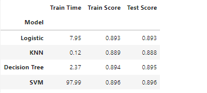
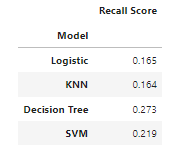
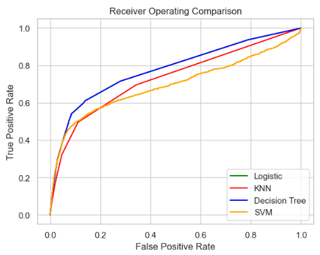
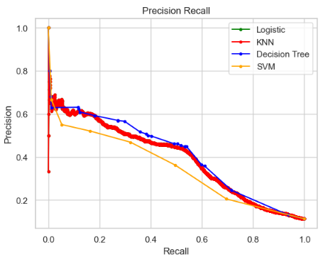

# Goal
The goal of this project is to determine the likelihood a customer will open a new savings account so that we can have a targeted campaign rather than a broad campaign targeting only the customers who are most likely to open the new accounts. Banks can have millions of customers, and there is a very significant unit cost in doing broad marketing campaigns especially when there is a desire to make it individualized. If a bank can predict which customers are most likely to buy a product, they can design personalized marketing campaigns and create a much better conversion funnel.

# Approach
The dataset that I have is fairly exhaustive and clean one that covers 41000 outcomes from the new savings accounts phone marketing campaign. I have attempted to determine fit several different models for predicting if a given customer will open the new account or not. I first started with analyzing every attribute and any potential correlations, and as an outcome of this I ended up discarding several attributes. The baseline score for the dataset was 88.7% and we have to find models that will match this. 

Started with logistic regression, then expanded to KNN, decision trees and finally support vector machines. Once the base models were built, I used hyperparameter tuning to see if I can get an even better fit. In all the models I created, the tuning did not result in a significant improvement in model performance.

My notebook for the project is [here](prompt_III.ipynb).

# Findings
There are several key findings:
- The outcome was correlated with the duration of the call which intuitively makes sense as a customer opening the new account would have been on the call longer to process the new account. However that cannot be used as a predictive attribute as the duration of the call is unknown for a new customer until the bank has called them.
- In the case of bank marketing:
False Positive - Means the model chose someone who didn't actually open the new product
False Negative - Means the model failed to pick someone who did indeed open the new account
- We want a model that has the best chance of reaching the most potential customers, there is no risk in reaching out to a few extra customers, so the model would need to have the best recall

The Decision Tree model has the best recall and the best accuracy as clearly evidenced by the model comparisons.

